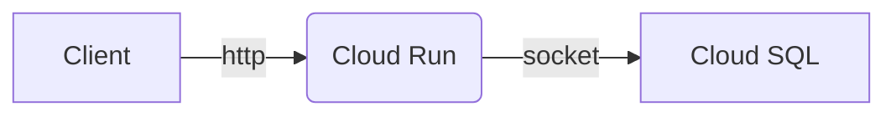

# Flask SQLalchemy app

Example Flask application which stores data in PostgreSQL database

## Initial setup

Install dependencies and develop locally

```bash
python3 -m venv .venv
source .venv/bin/activate
python3 -m pip install -r requirements.txt
```

Run application locally with docker-compose

```bash
pip install docker-compose
docker-compose up --build
```

Run pre commit hooks

```bash
pip install pre-commit
pre-commit install
pre-commit run --all-files
```

## Deploy GCP infrastructure



Create base infrastructure. Be sure to update `backend.tf` to setup remote backend

```bash
cd deploy/
terraform init
terraform plan
terraform apply
```

## Build and deploy application

Build and update image in Cloud Run using BlueGreen deploy technique

```bash
gcloud init
./deploy.sh
```
